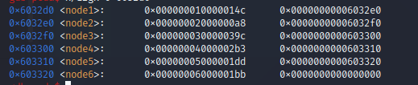

# bomblab
做这个大概做了我2天左右的时间吧，属实有点顶，硬肝汇编是真的酸爽

### phase_1
这道题比较简单，随便输入一个东西
汇编代码如下：

可以看到就跟一个字符串进行比较，字符串的位置在0x402400
gdb调试时可以看到是
Border relations with Canada have never been better.

### phase_2
这道题也比较简单，直接上汇编代码

主要关注<read_six_numbers>，看名字就知道是读6个数字（事实也是这样），然后取第一个数看是否是1，不是就炸。
接着往下看，可以发现是将1*2，判断输入的第二个值是否与它相等，不是就炸
很显然是输入 1 2 4 8 16 32

### phase_3
第三题是多解题目

其主要逻辑是输入2个数（因为调试时看到了一个"%d %d"），然后要求第一个输入的值必须小于等于7，然后根据第一个数字跳转到不同的地址来获得第二个比较的值
输入1的时候得到的值是311
所以答案为
1 311

### pahse_4
第四题也是个多解题目（我印象中1 0，3 0，7 0）均满足

第四题也是输入2个数（同phase_3），接下来可以看到这是一个递归调用
以下是我对该函数的分析图

要求必须时eax=0返回才有效，在eax+=eax返回时是无效的，会爆炸
在模拟过程中，发现1 3 7 都可以解决问题
解决了第一个，第二个就是判断是否为0，比较简单
答案为7 0

### pahse_5
是个酸爽的题目

这道题让你输入6个字符然后根据6个字符，取每个字符的前4位数来作为索引，索引字符，索引表格如下

然后判断索引后的字符是否等于‘flyers’。
显然是多解的题目
我写了个脚本跑答案为
‘)/.%&'’
脚本放在目录的phase_5.py里

### phase_6
这是最酸爽的，肝了我好久，我人都要🤮了（果然汇编代码真的是又臭又长）
汇编源码就不上了太长了（现在发现就算发了汇编源码大家估计也不看）
直接上我分析后的结果

代码逻辑如下：
首先读6个数字,判断6个数字是否都小于7且互不相等（先取一个数字，判断是否小于7，然后跟剩下的5个数字比较是否不同，再取第二个数字，判断是否跟剩下的4个数字比较是否不同，以此类推）
然后让所有的值进行变换，现在的值（a来表示）=7-原来的值
（b来表示）
后面的代码看得我云里雾里，分析好久才发现是链表操作（好家伙，我直接投降），0x6032d0开始，16字节为一个节点地址，存放两项，分别为值，下一个节点的地址，接下来代码的逻辑是取出第a个节点的地址存放进(rsp+0x20+8*(a-1))中。跳到0x4011ab处，这里对处在链表的结点做了处理，即将链表排序为栈中的存放顺序。（即更改链表节点中的下一个节点的地址）
这是最后一步，每一项的值都必须比后一项的值大，好家伙，走到这里我都快哭了

按照之前的顺序，显然是3 4 5 6 1 2
但是因为做了7-原值的操作，所以输入变为了4 3 2 1 6 5
答案为
4 3 2 1 6 5